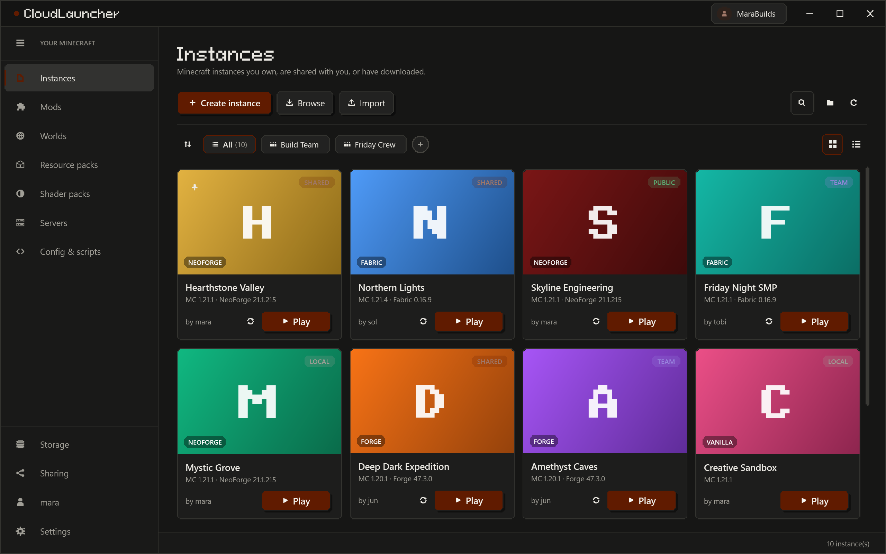

# CloudLauncher

A Minecraft launcher for Windows that keeps your modded instances on a server. Set a pack up
once, download it on any PC, or share it with friends with a link.



**Download:** [cloudlauncher.co](https://cloudlauncher.co)
**Discord:** [discord.gg/PU6HpxzJwW](https://discord.gg/PU6HpxzJwW)
**Bugs and ideas:** [GitHub issues](https://github.com/falling-colud/CloudLauncher/issues), or
Settings > About > Report a problem inside the launcher.

## Features

- Instances synced to your account, with sharing, teams and invitations
- Mod management across instances: updates, categories, dependency graph, planning boards
- Modrinth and CurseForge browsing, CurseForge and Modrinth pack import and export
- Worlds, resource packs and shader packs, with backups and hosting
- A servers page with live status and an RCON console
- Config and KubeJS script tools that work across instances
- The Slate look, or a classic one, with your own accent colour

## Repository

| Folder | What's in it |
| --- | --- |
| `CloudLauncher/` | The Windows app (WPF, .NET 10) |
| `CloudLauncher.Server/` | The API and website (ASP.NET Core, PostgreSQL) |
| `CloudLauncher.Shared/` | Types and helpers used by both |
| `installer/` | Inno Setup script for the installer |
| `deploy/` | nginx, systemd and docker-compose files for the server |
| `tools/` | Release scripts, the smoke test, font and icon builders |

## Building

You need the .NET 10 SDK. The app builds on Windows 10 or 11.

```
dotnet build CloudLauncher/CloudLauncher.csproj
```

Set `CL_PROFILE` to keep a development build's data apart from an installed launcher:

```
set CL_PROFILE=dev
CloudLauncher\bin\Debug\net10.0-windows\CloudLauncher.exe
```

The server needs PostgreSQL. Configuration comes from environment variables (or user secrets),
never from files in the repo:

| Variable | Meaning |
| --- | --- |
| `ConnectionStrings__Postgres` | PostgreSQL connection string |
| `Jwt__SigningKey` | Random secret, at least 32 characters |
| `Blobs__RootPath` | Where uploaded files are stored |
| `Launcher__RootPath` | Where launcher releases are stored |
| `App__PublicBaseUrl` | The public HTTPS address of the server |

```
dotnet run --project CloudLauncher.Server
```

`build-installer.ps1` builds the installer (needs Inno Setup 6), and `tools/release/README.md`
describes how releases are signed and published.

## License

CloudLauncher is source-available, not open source: you can read the code and build it for
your own use, but not redistribute it or run your own copy for others. See [LICENSE](LICENSE)
for the exact terms and [THIRD-PARTY-NOTICES.txt](THIRD-PARTY-NOTICES.txt) for the components
it includes.

Found a security problem? See [SECURITY.md](SECURITY.md).

CloudLauncher is not an official Minecraft product. It is not approved by or associated with
Mojang or Microsoft.
